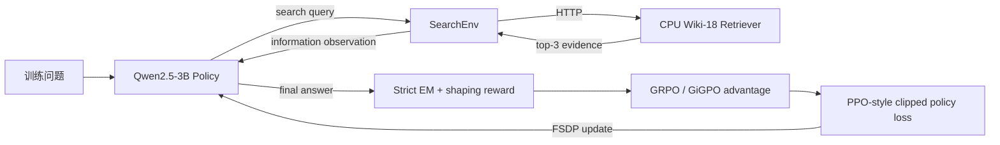
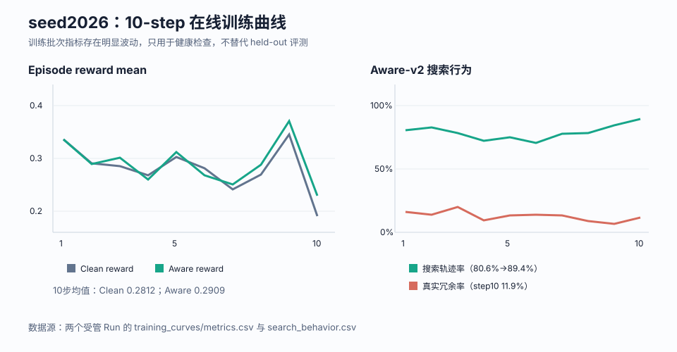
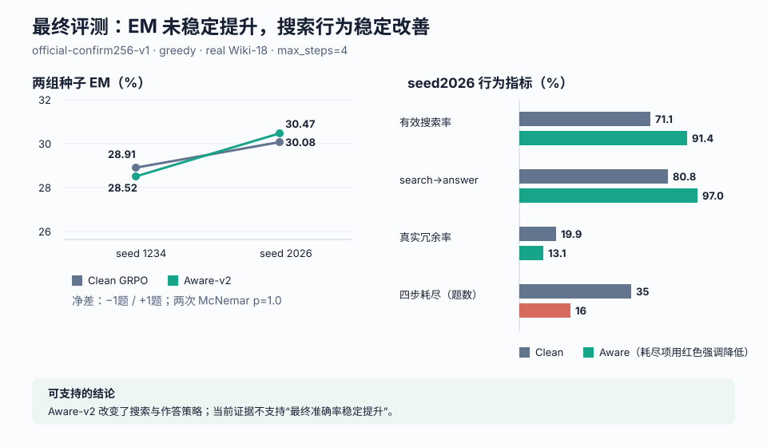

# Search-R1 工程复现与 Search-aware v2：最终学习和面试讲解文档

> 最终结论：本项目完成了 Search-R1 在 veRL/verl-agent 上的工程复现，并针对“模型不搜索、
> 搜索后不作答、冗余搜索”做了 Search-aware v2 改进。改进稳定改变了搜索与作答倾向，但两组种子
> 没有证明最终 EM 稳定提升。这是一个完整、可审计、结论克制的工程型 RL Agent 项目。

## 1. 面试时先讲什么

可以用下面这段作为一分钟版本：

> 我复现了 Search-R1 的多轮搜索强化学习链路：模型先生成 search action，Wiki Retriever
> 返回证据，模型继续推理并提交 answer，最终用严格 EM 奖励训练。我使用 Qwen2.5-3B、veRL、
> vLLM、Ray 和 6 卡 FSDP，分别跑通 GRPO 与 GiGPO。复现后发现 outcome-only reward 太稀疏，
> 而第一次 search-aware v1 又因冗余惩罚过强导致模型学会少搜索。于是我恢复原版 prompt、
> projection 和终止协议，只在奖励与信用分配层设计 Aware-v2：真实证据命中奖励、有证据且
> 答对奖励，并惩罚无效查询、真正冗余检索和答案泄漏。最终两组 seed 的准确率分别是净 −1
> 和 +1，不能说 EM 提升；但搜索率和搜索后作答率在两组 seed 都改善，seed2026 的四步耗尽
> 也从35题降到16题。这个项目的重点是
> 复现、定位 reward hacking、做单变量改进，并用 held-out 配对检验和反事实证据验证结论。

## 2. 项目目标与完成状态

项目目标不是发表新算法，而是形成一条秋招可讲清楚的工程主线：

1. 复现 Search-R1 的搜索环境、Retriever、奖励、RL 更新和 checkpoint/eval 闭环；
2. 在完全相同协议下复现 GRPO 与 GiGPO，理解 advantage 的差异；
3. 找出原始链路的实际问题，而不是只看 loss；
4. 做一个可归因的小改进，并用多 seed、held-out 和反事实实验检验；
5. 保存日志、rollout、曲线、哈希和安全验收记录，使结果可复算。

当前均已完成。实验层面可以停止，不需要继续训练。

## 3. 系统如何工作



核心技术栈：

| 层 | 实现 |
|---|---|
| Policy | Qwen2.5-3B-Instruct，全参数训练 |
| RL 框架 | veRL/verl-agent，Ray 调度，FSDP 参数/优化器/Reference offload |
| Rollout | vLLM；环境侧 group size `n=5` |
| 环境 | SearchEnv，`<search>` / `<information>` / `<answer>` 多轮协议 |
| Retriever | Wiki-18，E5 768维，IndexFlatIP，21,015,324 vectors，top-k=3 |
| 训练卡 | 物理 GPU `1,2,3,4,6,7`；GPU0 禁用，GPU5 排除 |
| 正式规模 | 每步 66 个 prompt × 5 rollout = 330 trajectories；10 steps |
| 评测 | 独立 confirm256，greedy `temperature=0`，逐题配对 |

这里的“256”是固定的 held-out 评测题数，不是只拿 256 个问题做 RL。训练从 NQ/HotpotQA
训练池采样；每个 optimizer step 消费 66 个 prompt，每个 prompt 生成 5 条同组 trajectory。

## 4. GRPO、GiGPO 与 Aware-v2 的关系

它们不是三个同时叠加的算法。

| 方案 | 变化位置 | 直观解释 | 本项目用途 |
|---|---|---|---|
| GRPO | episode outcome 的组内归一化 advantage | 同一道题采样5条轨迹，奖励高于组均值的轨迹得到正优势 | Search-R1 主基线 |
| GiGPO | episode advantage + 相似状态的 step advantage | 不只比较整条轨迹，还尝试在相似中间状态间分配信用 | 独立复现对照线 |
| Aware-v2 | reward + trajectory-return credit，adv estimator 仍为 GRPO | 告诉模型什么是有效搜索，并把整条轨迹回报广播到动作记录 | 项目适度改进 |

因此准确表述是：**先分别复现 GRPO 和 GiGPO；随后选择 GRPO 作为干净对照，对奖励和信用
分配做 Aware-v2 改进。**

相对原版 Search-R1，本项目没有改模型输入协议、clean prompt、search projection、Retriever
或四轮终止条件；Aware-v2 只改训练期 reward/return/audit。这保证 Clean 与 Aware 的差异
能尽量归因到奖励和信用分配，而不是 prompt engineering。

## 5. 奖励如何判断“搜索证据有效”

### 5.1 Clean GRPO

原始 clean 线主要是 outcome-only：最终答案通过 skyRL strict EM 得 `1.0`，否则 `0`；
`format_score=0.0`。它能优化答对与否，但无法直接区分“有用搜索、无关搜索、重复搜索”。

### 5.2 Aware-v2 公式

```text
R = R_answer
  + 0.15 × first_evidence_hit
  + 0.30 × searched_and_correct_with_evidence
  - 0.20 × invalid_or_error
  - 0.20 × true_redundant_search
  - 0.20 × new_answer_leak_in_query
```

有效证据不是由另一个模型主观打分，而是一个可审计 proxy：

1. 只检查 Retriever 真正返回的 document body，不检查 query、错误文本或模型输出；
2. 将 ground-truth aliases 和文档做 NFKC、casefold、Unicode token 化；
3. alias 必须作为连续完整 token phrase 出现在文档中，避免 `us` 误命中 `museum`；
4. Retriever 状态必须有效，query 不能把题目中原本没有的答案 alias 直接泄漏进去；
5. `searched_and_correct` 还要求最终答案 strict EM 正确，防止只“搜到词”却不会回答。

真正冗余的定义也不是“第二次搜索一律处罚”：只有规范化 query 重复，或本次检索没有带来
新的 document ID（必要时使用 content hash fallback）才算冗余。第一次检索和能带来新证据的
后续检索不受罚。

这个 proxy 仍有边界：文档出现答案 alias 不等于证据逻辑一定充分；它适合做低成本、确定性、
可复算的 reward signal，不应被描述成完美的证据质量判别器。

## 6. 为什么先失败了一次：v1 的价值

Search-aware v1 的冗余惩罚是 `−0.45`，并把第二次及后续搜索都视作冗余。10步后模型通过
“减少搜索”规避惩罚：搜索率下降，搜索轨迹答对数为0，confirm256 EM 只有30/256；而且
v1 同时改过 prompt/projection/format，使它不能与 clean 线做严格单变量比较。

这个失败促成 v2 的三点修正：

- 恢复 clean prompt、projection、`format_score=0.0` 和相同起始模型；
- 将冗余惩罚降到 `−0.20`，只惩罚真正重复或没有新增文档的搜索；
- 用 trajectory return 在每题5条轨迹间做 GRPO 归一，再广播给该轨迹的 action records，
  Observation token 继续保持 loss mask 为0。

面试中这部分很重要：它展示的不是“第一次就调出好结果”，而是发现 reward hacking、恢复
可比协议、再做单变量修正。

## 7. 最终训练情况

seed2026 的 Clean 与 Aware 均从同一个 Qwen2.5-3B Step0 fresh start，完成 10/10 steps：

| 项 | Clean GRPO | Aware-v2 |
|---|---:|---:|
| 训练时长 | 3:40:04 | 3:48:20 |
| 10步平均 episode reward | 0.2812 | 0.2909 |
| 10步平均 success rate | 0.2812 | 0.2897 |
| 10步平均 tool calls | 1.2013 | 1.2738 |
| Checkpoint | gs5、gs10 完整 | gs5、gs10 完整 |
| 退出 | exit 0 | exit 0 |



曲线的正确读法：两个 run 的 reward/success 都有明显 batch 波动，例如第9步高、第10步回落；
这不代表模型在第10步“退化”，因为每一步是不同的 on-policy batch。训练曲线主要用于发现
OOM、NaN、KL/梯度异常、行为坍缩和吞吐变化；模型质量必须看固定 held-out 评测。

原始详细曲线保存在数据盘：

- Clean：`/media/imc/data/project3-search-agent-rl/runs/p3-clean-grpo10-seed2026-fsdp6-20260824a/training_curves/index.html`
- Aware：`/media/imc/data/project3-search-agent-rl/runs/p3-aware-v2-grpo10-seed2026-fsdp6-20260824a/training_curves/index.html`

目录还包含 `metrics.csv`、`summary.json`、`training_overview.svg`、`training_system.svg`；
Aware 额外包含 `search_behavior.csv/svg`。以后通过受管脚本结束的训练会自动生成这些产物。

## 8. 最终 held-out 结果

### 8.1 两组种子的主指标

| seed | Clean GRPO | Aware-v2 | 净变化 | McNemar p |
|---|---:|---:|---:|---:|
| 1234 | 74/256（28.91%） | 73/256（28.52%） | −1 | 1.0 |
| 2026 | 77/256（30.08%） | 78/256（30.47%） | +1（gained 23 / lost 22） | 1.0 |

seed1234 的精确 contingency 以
[`P3_V2_TEN_STEP_REPORT_2026-08-24.md`](P3_V2_TEN_STEP_REPORT_2026-08-24.md) 为准。
两组种子方向相反、量级均为1题，所以不能声称 Aware 提升了 EM。

### 8.2 seed2026 行为分解

| 指标 | Clean | Aware-v2 | 差值 |
|---|---:|---:|---:|
| EM | 77/256 | 78/256 | +1题 |
| 有效搜索题 | 182（71.09%） | 234（91.41%） | +52题 |
| search→answer | 80.77% | 97.01% | +16.24pp |
| 搜索且答对 | 56 | 71 | +15 |
| 未搜索且答对 | 21 | 7 | −14 |
| search→correct | 30.77% | 30.34% | −0.43pp |
| answer compliance | 221 | 249 | +28 |
| max-steps 耗尽 | 35 | 16 | −19 |
| true-redundant rate | 19.93% | 13.11% | −6.82pp |



最关键的解释是：Aware 把模型从“更多依靠闭卷直接答”推向“更多先搜再答”。搜索且答对增加
15题，但未搜索且答对减少14题，所以最终只净增1题。也就是说，**行为塑形成功，端到端准确率
收益尚未形成。**

### 8.3 真实证据是否真的有用

对 seed1234 Aware-v2 gs10 的同一个 checkpoint，只改变 Retriever 返回内容：

| 条件 | EM | 搜索且正确 | 未搜索且正确 |
|---|---:|---:|---:|
| real evidence | 73/256 | 65 | 8 |
| shuffled evidence | 10/256 | 2 | 8 |
| no evidence | 18/256 | 10 | 8 |

real 对 shuffled/no-evidence 的配对检验均 `p<1e-8`；搜索题上的正确答案大多在破坏证据后
翻转，而未搜索且正确始终是8题。这支持“模型确实利用了真实检索证据”，但不证明 Aware-v2
优于 Clean GRPO——这是机制验证与模型间比较的区别。

## 9. 四轮交互上限怎么解释

当前 `max_steps=4` 与原 clean 对照协议保持一致。环境先增加 turn，再判断是否达到上限，
因此实际最多执行三次 Retriever 调用，第四个动作最好用于 final answer；若第四步仍搜索，
该检索不会真正执行，episode 会耗尽终止。

这既控制 rollout 成本，也带来强制终止偏差。Aware-v2 已将 seed2026 的耗尽题从35降到16，
但**四轮限制本身没有修复**。后续正确顺序是：先补 typed termination reason，再只改一个变量，
优先在检索预算结束后增加独立 final-answer slot；先做 evaluation-only，确认 EM 不退化后再决定
是否训练。详细计划见
[`P3_TRAINING_CURVES_AND_TURN_CAP_PLAN_2026-08-24.md`](P3_TRAINING_CURVES_AND_TURN_CAP_PLAN_2026-08-24.md)。

## 10. 训练为什么耗时、显存为什么满

一次 step 不只是一次反向传播：

```text
66 prompts
  → 每题5条 rollout，共330条多轮 trajectory
  → vLLM 自回归生成 + 多次 Retriever 请求
  → old/ref log-prob
  → reward 与 GRPO advantage
  → FSDP actor update
  → 必要时保存6份 checkpoint shard
```

主要显存消费者是 vLLM 的模型权重/KV cache、FSDP actor 参数与梯度、optimizer state、
reference policy 和临时激活。项目使用参数/优化器/reference offload 与
`gpu_memory_utilization=0.60`，不是简单把显存全留给训练权重。seed2026 评测峰值约
Clean 13,947 MiB、Aware 14,081 MiB；训练日志保留 veRL allocator 指标，但 Aware 本轮的
逐物理卡峰值 sampler 文件缺失，因此不能编造每张卡的精确峰值分解。

## 11. 项目的可信度设计

- 同题5条 rollout 做组内比较，减少依赖单一 value model；
- Clean/Aware 从同一 Step0、同一数据与协议出发，只改 reward/credit；
- 固定 confirm256、greedy、真实 Retriever，按 question_id 逐题配对；
- 使用 exact McNemar，而不是只比较两个百分比；
- 通过 shuffled/no-evidence 反事实区分“调用了搜索”与“依赖了证据”；
- 两组训练种子验证方向稳定性；
- 保存 checkpoint、episodes、audit、曲线、SHA256、退出和资源清理证据；
- 失败的 v1 不删除、不包装成成功结果。

## 12. 诚实的项目边界

可以说：

- 完成了 veRL 下 Search-R1 的 GRPO/GiGPO 工程复现；
- Aware-v2 在两组 seed 上稳定改善搜索率和搜索后作答；seed2026 同时降低冗余与四步耗尽；
- 反事实实验支持模型真实使用 Retriever 证据；
- 建立了安全启动、checkpoint、曲线、审计和配对评测闭环。

不能说：

- Aware-v2 稳定提升最终准确率；
- 达到论文官方完整规模或 SOTA；
- evidence-hit proxy 等于完美证据判别；
- `max_steps=4` 已修复；
- 训练 reward 上升就证明泛化变好。

## 13. 常见追问与回答

**Q：为什么不用 loss 判断训练好坏？**

A：RL 的 policy loss 会受 advantage 归一化、clipping 和 on-policy 数据分布影响，绝对值不等价于
任务质量。看训练健康用 reward、KL、entropy、grad norm、clip fraction；看泛化必须用固定
held-out EM 和行为指标。

**Q：GRPO 和 GiGPO 是同步训练的吗？**

A：它们是相同协议下的独立对照 run。最终 Aware-v2 的 advantage estimator 是 GRPO；GiGPO
用于验证 step-level credit baseline，没有与 Aware 同时叠加。

**Q：证据里出现答案，会不会 reward hacking？**

A：存在 proxy 风险，所以只检查 Retriever 文档正文，做完整 token phrase 匹配，query 新泄漏
答案会被扣分；并额外用 shuffled/no-evidence 反事实确认正确答案依赖真实证据。

**Q：行为改善为什么没有转化成 EM？**

A：Aware 增加了搜索且答对，但同时减少闭卷答对；search→correct 没有提高。下一步应提升 query
质量和 evidence-to-answer 转化，而不是继续单纯鼓励更多搜索。

**Q：如果再做一步，你会做什么？**

A：先做 evaluation-only 的独立 final-answer slot，修正四轮耗尽偏差；若不增加冗余成本且 EM
不退化，再做小规模同 seed 训练消融。不会直接扩大训练步数。

## 14. 最终证据索引

- 最终 seed2026 执行记录：
  [`P3_SEED2026_PAIR_EXECUTION_LOG_2026-08-24.md`](P3_SEED2026_PAIR_EXECUTION_LOG_2026-08-24.md)
- 两组种子预注册：
  [`P3_AWARE_V2_MULTISEED_PAIR_PREREG_2026-08-24.md`](P3_AWARE_V2_MULTISEED_PAIR_PREREG_2026-08-24.md)
- seed1234 十步报告：
  [`P3_V2_TEN_STEP_REPORT_2026-08-24.md`](P3_V2_TEN_STEP_REPORT_2026-08-24.md)
- 反事实结果：
  [`P3_V2_GS10_COUNTERFACTUAL_RESULT_2026-08-24.md`](P3_V2_GS10_COUNTERFACTUAL_RESULT_2026-08-24.md)
- 曲线与四轮计划：
  [`P3_TRAINING_CURVES_AND_TURN_CAP_PLAN_2026-08-24.md`](P3_TRAINING_CURVES_AND_TURN_CAP_PLAN_2026-08-24.md)
- 权威 seed2026 统计：
  [`../gates/p3_seed2026_pair_stats_20260824.json`](../gates/p3_seed2026_pair_stats_20260824.json)
- 曲线生成器：
  [`../scripts/generate_training_curves.py`](../scripts/generate_training_curves.py)
- 实验安全规则：
  [`EXPERIMENT_SAFETY.md`](EXPERIMENT_SAFETY.md)

这份文档是当前项目的最终讲解入口；更早报告用于追溯实验演化，不应替代这里的多 seed 结论。
