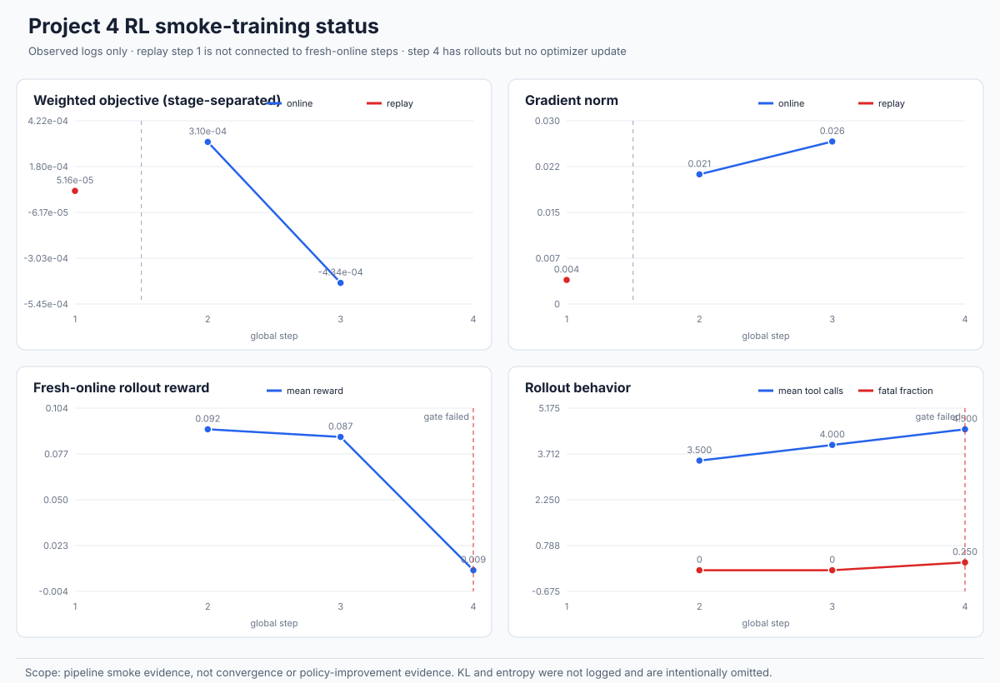

# Project 4 RL smoke 训练状态图

## 结论边界

项目四已有足够的原始日志绘制**链路验证级** RL 状态图。当前证据证明 replay GRPO 和
fresh-online GRPO 均实际执行过 optimizer update，但步数不足以判断收敛或策略质量提升。



图中严格区分：

- Step 1：历史 rollout 的 replay update；
- Step 2～3：fresh rollout 后的 online update；
- Step 4：rollout 已产生，但 optimizer gate 未通过，没有伪造 loss 或 grad norm；
- KL 和 entropy：原日志没有记录，因此图中不展示。

## 可复核数据

- [`p4_rl_smoke_metrics.csv`](assets/rl-smoke-20260825/p4_rl_smoke_metrics.csv)：逐 step 指标；
- [`p4_rl_smoke_events.jsonl`](assets/rl-smoke-20260825/p4_rl_smoke_events.jsonl)：12 条规范化 rollout
  事件，只包含 step、reward、工具名、fatal 和成功状态，不包含模型输出或密钥；
- [`p4_rl_smoke_source_manifest.json`](assets/rl-smoke-20260825/p4_rl_smoke_source_manifest.json)：
  原始 stdout、replay state 和两个 online checkpoint state 的字节数与 SHA256；
- [`generate_rl_smoke_curves.py`](../scripts/generate_rl_smoke_curves.py)：CPU-only 可复现生成器。

原始 online `stderr.log` 约 224 KiB，包含冗长 traceback/运行输出，没有提交；它仍保留在数据盘
失败 Run 中。仓库提交的规范化事件日志约 2.3 KiB，完整覆盖绘图使用的 12 条 rollout 事件。

## 真实数值

| Step | 阶段 | optimizer update | weighted loss | grad norm | mean reward | fatal fraction |
|---:|---|---:|---:|---:|---:|---:|
| 1 | replay | 1 | 0.0000516244 | 0.00388589 | — | — |
| 2 | fresh-online | 1 | 0.000310304 | 0.0209465 | 0.0919730 | 0 |
| 3 | fresh-online | 1 | -0.000433661 | 0.0262512 | 0.0874447 | 0 |
| 4 | fresh-online rollout-only | 0 | — | — | 0.00881402 | 0.25 |

weighted objective 可为负，因为实现计算的是 advantage 加权 assistant cross-entropy；不能把其
符号直接解释成普通监督学习 loss 的好坏。

## 再生成

在仓库根目录执行：

```bash
python3 project4-opensearch-vl-rl/scripts/generate_rl_smoke_curves.py \
  --replay-run /media/imc/data/yzy/agent/project4-opensearch-vl-rl/runs/official-provider-grpo-replay-1step-20260825 \
  --online-run /media/imc/data/yzy/agent/project4-opensearch-vl-rl/runs/official-provider-grpo-online-step5-20260825 \
  --output-dir project4-opensearch-vl-rl/docs/assets/rl-smoke-20260825
```

该命令不加载模型、不访问网络、不使用 GPU。
